# Smoke Tests

## Proyecto: Sistema de Base de Datos - Distribuidora de Gaseosas del Valle S.A.

---

## 1. Introducción

Este documento recopila las pruebas de humo (smoke tests) realizadas sobre la base de datos `GaseosasDelValle`, con el objetivo de verificar que los scripts principales del proyecto (`schema.sql`, `functions.sql`, `triggers.sql` y `views_and_queries.sql`) se ejecutan correctamente en MySQL, sin errores de sintaxis ni de dependencias entre objetos.

Las pruebas consisten en la ejecución directa de cada script en la consola de MySQL, evidenciando mediante capturas de pantalla la salida generada por el motor de base de datos (creación de tablas, funciones, triggers, vistas, inserción de datos y resultados de consultas). No se trata de pruebas exhaustivas de casos límite, sino de una verificación básica de que el sistema, en su conjunto, se instala y responde correctamente cuando se ejecuta en el orden establecido en el README.

El objetivo es confirmar que:

- La base de datos y las tablas se crean sin errores y con las relaciones definidas.
- Las funciones almacenadas se crean correctamente y quedan disponibles para su uso por parte de los triggers y las consultas.
- Los triggers se crean sin errores de sintaxis y sin conflictos de dependencias con las funciones.
- Las vistas se crean correctamente y las consultas de explotación de datos retornan resultados coherentes con los datos de prueba cargados en `schema.sql`.

A continuación se documenta cada prueba realizada, indicando el script o sentencia ejecutada y el resultado observado en consola.

## 2. Pruebas de schema.sql

**Objetivo:** verificar que la base de datos, las seis tablas y los datos de prueba se crean correctamente, respetando el orden de dependencias entre llaves foráneas.

**Script ejecutado:** `database/schema.sql`

**Resultado observado:**

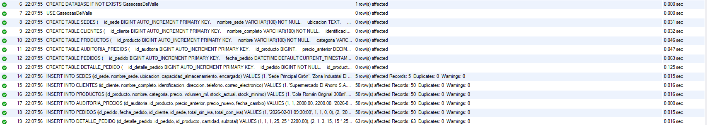

**Estado:** Exitoso

**Observaciones:** las seis tablas se crearon en el orden correcto respetando las dependencias de llave foránea (`AUDITORIA_PRECIOS` depende de `PRODUCTOS`; `PEDIDOS` depende de `CLIENTES` y `SEDES`; `DETALLE_PEDIDO` depende de `PEDIDOS` y `PRODUCTOS`). Todas las inserciones de datos de prueba se ejecutaron sin conflictos de integridad referencial ni de restricciones `UNIQUE` o `NOT NULL`. Los conteos de registros afectados coinciden con los valores esperados: 5 sedes, 50 clientes, 50 productos, 50 registros de auditoría, 50 pedidos y 63 detalles de pedido.

## 3. Pruebas de functions.sql

**Objetivo:** verificar que las tres funciones almacenadas se crean correctamente en la base de datos, sin errores de sintaxis ni de referencia a tablas inexistentes.

**Script ejecutado:** `database/functions.sql`

**Resultado observado:**

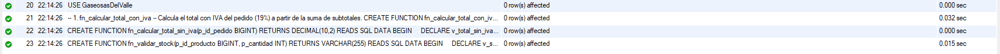

**Estado:** Exitoso

**Observaciones:** las tres funciones (`fn_calcular_total_con_iva`, `fn_calcular_total_sin_iva` y `fn_validar_stock`) se crearon sin errores. La creación no depende de datos existentes en las tablas, únicamente de que estas ya existan (`PEDIDOS`, `DETALLE_PEDIDO`, `PRODUCTOS`), por lo que el script se ejecutó correctamente después de `schema.sql`, confirmando el orden de dependencias definido en el README.

## 4. Pruebas de triggers.sql

**Objetivo:** verificar que los cuatro disparadores se crean correctamente, sin errores de sintaxis y respetando la dependencia con las funciones creadas previamente en `functions.sql`.

**Script ejecutado:** `database/triggers.sql`

**Resultado observado:**

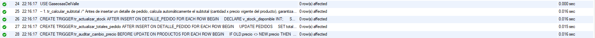

**Estado:** Exitoso

**Observaciones:** los cuatro triggers (`tr_calcular_subtotal`, `tr_actualizar_stock`, `tr_actualizar_totales_pedido` y `tr_auditar_cambio_precio`) se crearon sin errores. En particular, `tr_actualizar_totales_pedido` depende de las funciones `fn_calcular_total_sin_iva` y `fn_calcular_total_con_iva`, por lo que su creación exitosa confirma que el orden de ejecución establecido (`schema.sql` → `functions.sql` → `triggers.sql`) es correcto.

## 5. Pruebas de views_and_queries.sql

**Objetivo:** verificar que las tres vistas y las ocho consultas requeridas se ejecutan correctamente sobre los datos de prueba cargados en `schema.sql`.

**Script ejecutado:** `database/views_and_queries.sql`

### 5.1 Creación de vistas

Las sentencias `CREATE VIEW` no generan grilla de resultados, por lo que no se cuenta con captura del log de creación de `vista_resumen_pedidos_por_sede`, `vista_productos_bajo_stock` y `vista_clientes_activos` para este script. Pendiente de adjuntar.

### 5.2 Consulta 1 - Productos con stock por debajo del mínimo

**Resultado observado:**

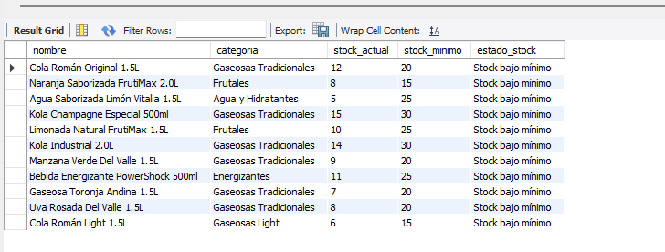

**Estado:** Exitoso. Se listan correctamente los productos cuyo `stock_actual` es menor o igual al `stock_minimo`, junto con la etiqueta `estado_stock`.

### 5.3 Consulta 2 - Pedidos entre dos fechas (BETWEEN)

**Resultado observado:**

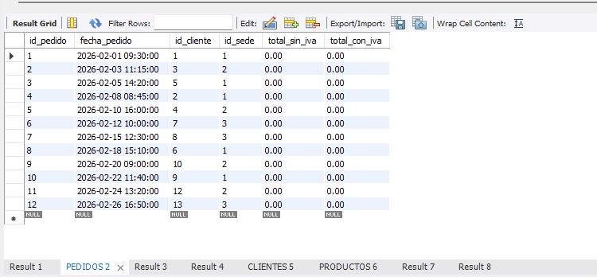

**Estado:** Exitoso. Se retornan únicamente los pedidos con `fecha_pedido` dentro de febrero de 2026.

**Observación:** los campos `total_sin_iva` y `total_con_iva` aparecen en 0.00 en todos los pedidos listados, a pesar de que el script ejecuta un `UPDATE PEDIDOS` al inicio para recalcularlos. Se recomienda verificar si el `UPDATE` se ejecutó en la misma sesión/conexión que esta consulta, o si existe un problema de commit, antes de dar por buena esta prueba.

### 5.4 Consulta 3 - Productos más vendidos (JOIN y GROUP BY)

**Resultado observado:**

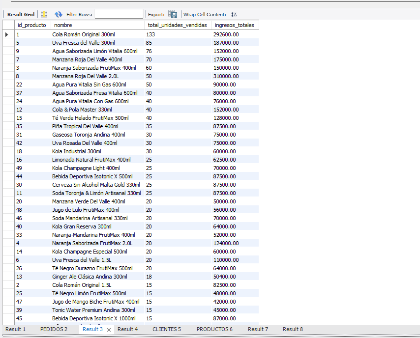
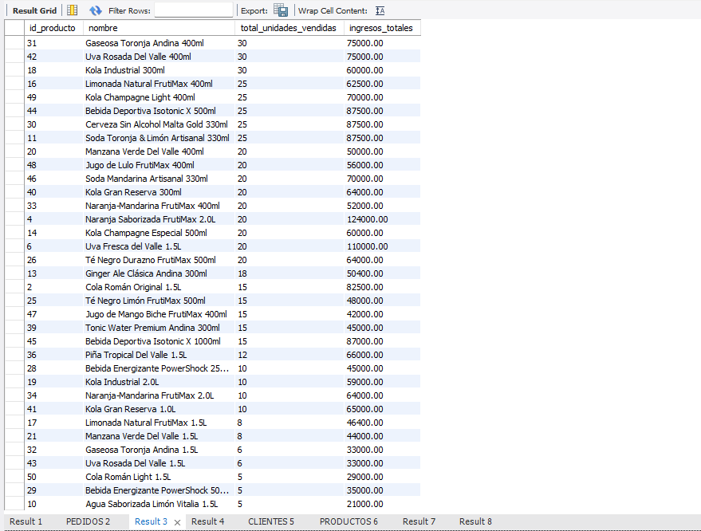

**Estado:** Exitoso. Los resultados están correctamente ordenados de forma descendente por `total_unidades_vendidas`, encabezados por Cola Román Original 300ml con 133 unidades vendidas.

### 5.5 Consulta 4 - Clientes y cantidad de pedidos

**Resultado observado:**

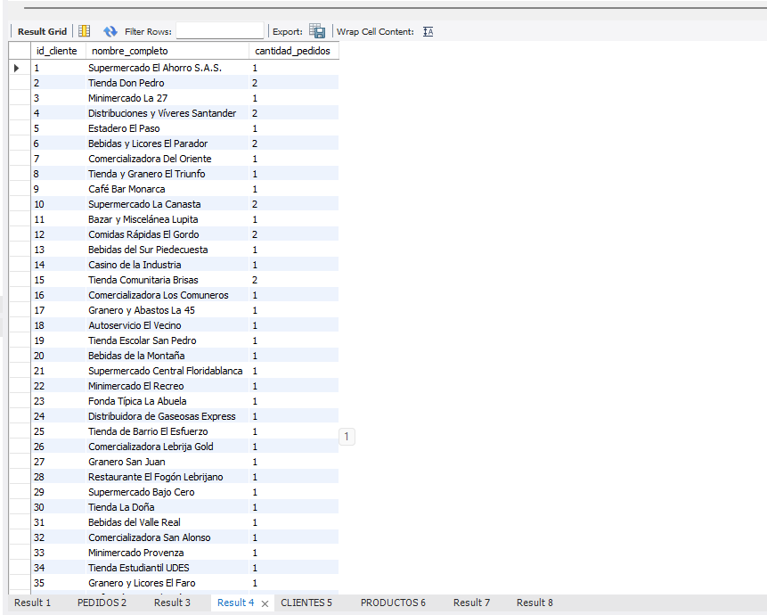
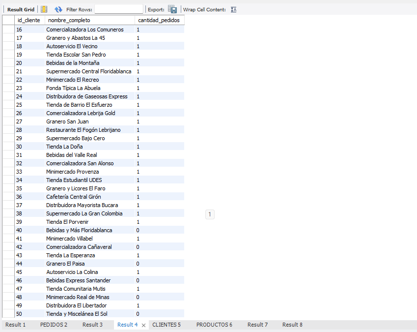

**Estado:** Exitoso. El `LEFT JOIN` permite ver también clientes con 0 pedidos (por ejemplo, id_cliente 40, 42, 44, 46, 50), confirmando que la consulta no excluye clientes sin actividad.

### 5.6 Consulta 5 - Búsqueda de clientes por nombre parcial (LIKE)

**Resultado observado:**

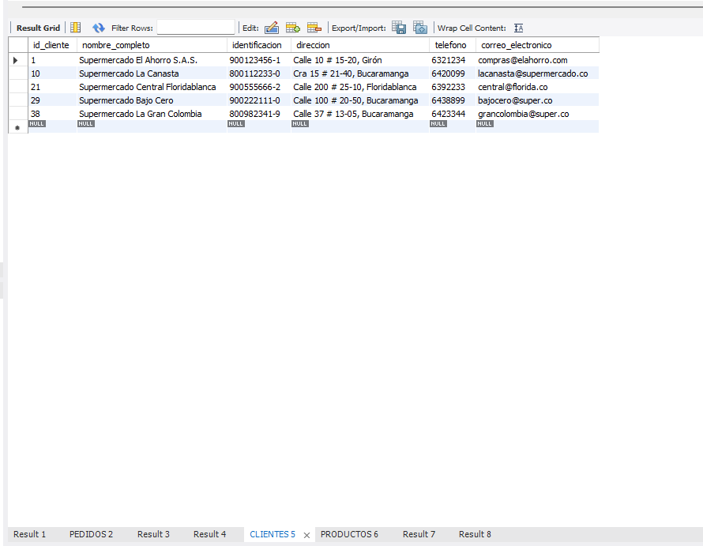

**Estado:** Exitoso. Se retornan únicamente los 5 clientes cuyo nombre contiene la palabra "Supermercado".

### 5.7 Consulta 6 - Productos por categoría (IN)

**Resultado observado:**

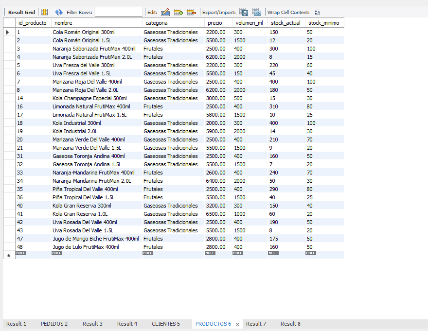

**Estado:** Exitoso. Se listan únicamente productos de las categorías "Gaseosas Tradicionales" y "Frutales".

### 5.8 Consulta 7 - Cliente con mayor número de pedidos (subconsulta)

**Resultado observado:**

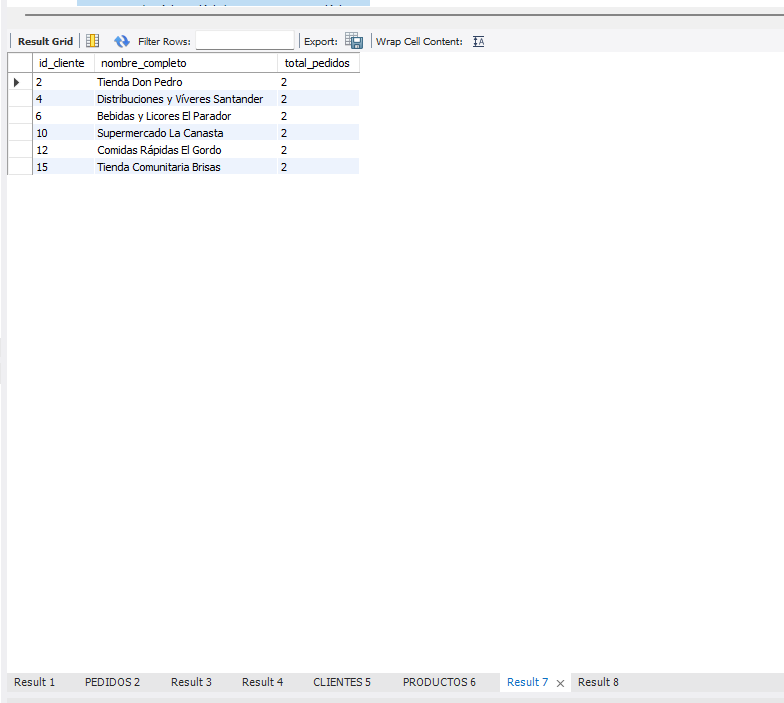

**Estado:** Exitoso. La subconsulta identifica correctamente el máximo de pedidos por cliente (2) y la consulta externa retorna los 6 clientes que alcanzan ese máximo, confirmando el manejo correcto de empates.

### 5.9 Consulta 8 - Pedidos y totales agrupados por sede

**Resultado observado:**

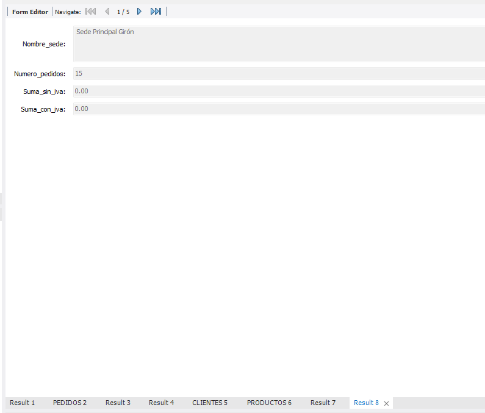
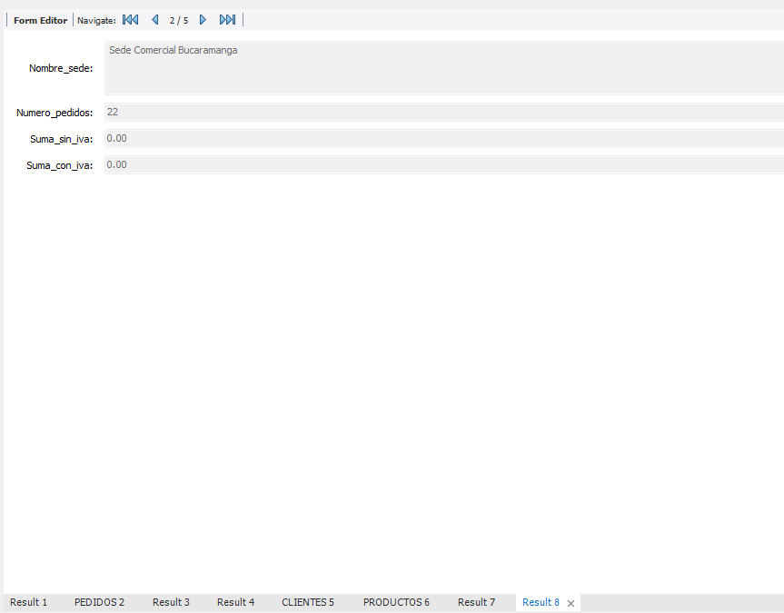
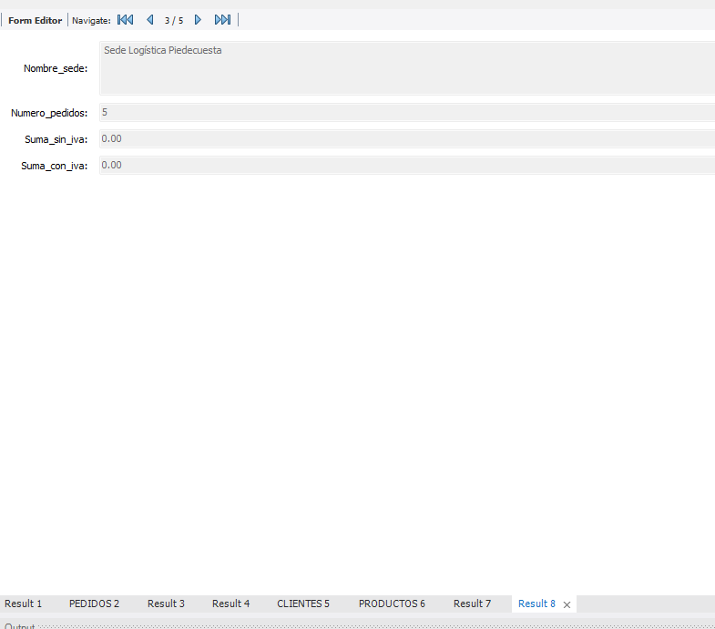
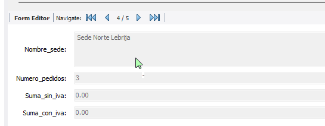
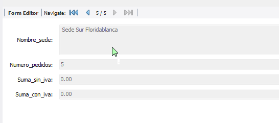

**Estado:** Exitoso en cuanto al conteo de pedidos por sede (15, 22, 5, 3 y 5, que suman los 50 pedidos totales cargados en `schema.sql`).

**Observación:** al igual que en la consulta 2, `suma_sin_iva` y `suma_con_iva` aparecen en 0.00 para las cinco sedes. Esto refuerza la sospecha de que el `UPDATE PEDIDOS` inicial del script no se reflejó en los datos consultados. Se recomienda repetir esta prueba verificando explícitamente el contenido de la tabla `PEDIDOS` después de ejecutar el `UPDATE`, antes de declarar esta prueba como completamente exitosa.